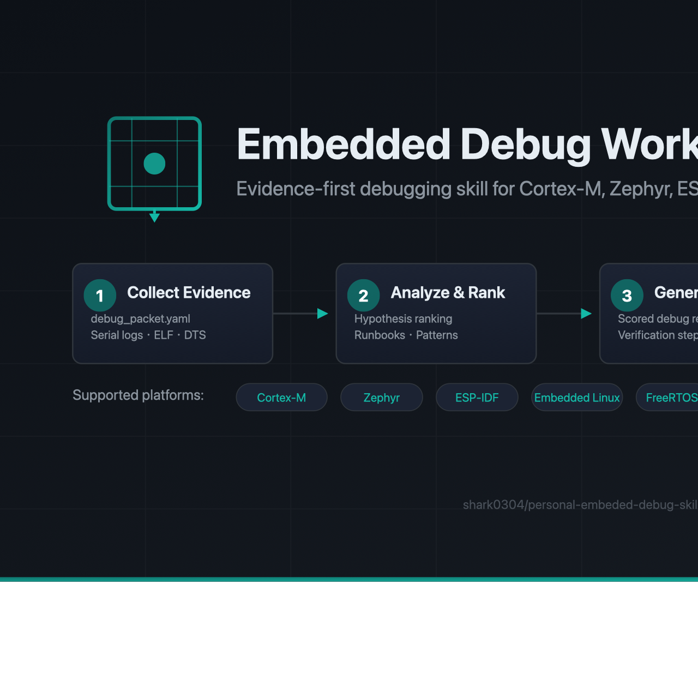
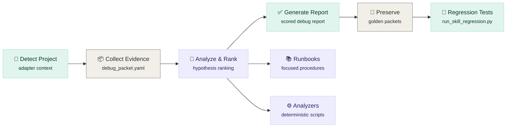

<p align="center">
  
</p>

<h1 align="center">Embedded Debug Workbench</h1>

<p align="center">
  <strong>Evidence-first debugging skill for Cortex-M, Zephyr, ESP-IDF, Linux, FreeRTOS, TinyML, and DMA/Cache</strong>
</p>

<p align="center">
  
  
  
  
  
</p>

<p align="center">
  <a href="#quick-start">Quick Start</a> •
  <a href="#real-project-adapters">Project Adapters</a> •
  <a href="#workflow">Workflow</a> •
  <a href="#supported-platforms">Platforms</a> •
  <a href="#repository-layout">Layout</a> •
  <a href="#validation">Validation</a>
</p>

<br/>

<p align="center">
  
</p>

<br/>

---

## Overview

Collected system artifacts → rank hypotheses with evidence → produce scored reports → preserve resolved cases as golden packets for regression.

### Two-skill model

This repository carries two related skills:

| Skill | Role | When to use |
|-------|------|-------------|
| **`embedded-project-builder`** | Upstream planning | 0-to-1 project scaffold, datasheet reading, driver bring-up, validation planning |
| **`embedded-debug`** | Downstream debug | After a concrete failure appears — collect packets, analyze, report, preserve |

Typical handoff:

```
project plan → scaffold → build → 🔴 FAIL → collect debug_packet.yaml → analyze → report → preserve as golden packet
```

<br/>

---

## Quick Start

Detect a real firmware/BSP project before debugging:

```bash
python scripts/project/detect_project_context.py \
  --project-root . \
  --format markdown
```

Create a project-local debug adapter packet:

```bash
python scripts/project/create_project_adapter.py \
  --project-root . \
  --out-dir debug/embedded_debug_adapter \
  --overwrite
```

Collect a project packet:

```bash
python scripts/collect/collect_debug_packet.py \
  --project-root . \
  --platform auto \
  --out debug_packet.yaml
```

Generate a report:

```bash
python scripts/reports/generate_debug_report.py \
  --packet debug_packet.yaml \
  --out debug_report.md

python scripts/verify/score_debug_report.py \
  --report debug_report.md
```

Analyze a Zephyr I2C sensor init failure:

```bash
python scripts/analyze/analyze_i2c_init_failure.py \
  --serial-log serial.log \
  --dts zephyr.dts \
  --config .config
```

Analyze a logic analyzer CSV:

```bash
python scripts/analyze/analyze_i2c_logic_trace.py \
  --trace logic_trace.csv
```

<br/>

---

## Real Project Adapters

The workbench now has a conservative adapter layer for real project directories. It detects common embedded project families, lists the smallest useful artifacts, suggests deterministic scripts, and marks risky actions before any command touches hardware.

| Adapter | Strong signals | Useful first evidence |
|---------|----------------|-----------------------|
| **Zephyr / nRF Connect SDK** | `west.yml`, `prj.conf`, generated `zephyr.dts` | build log, serial log, DTS, Kconfig |
| **ESP-IDF** | `sdkconfig`, `idf_component.yml`, `idf_component_register` | monitor log, partition table, ELF/map |
| **PlatformIO** | `platformio.ini` | selected environment, `.pio` ELF/map, serial log |
| **STM32Cube** | `.ioc`, `Core/Src`, `Drivers/CMSIS` | `.ioc`, linker script, fault registers, ELF/map |
| **Arduino** | `.ino` sketches | FQBN, serial log, core/package version |
| **Bare-metal CMake/Make** | `CMakeLists.txt`, `Makefile`, linker/startup files | build log, linker script, ELF/map |
| **Embedded Linux** | `Kbuild`, `Kconfig`, DTS/DTSI, module markers | boot log, `dmesg`, kernel config, DTS/DTB |
| **FreeRTOS** | `FreeRTOSConfig.h`, kernel sources | task snapshot, heap/stack state, ISR priorities |
| **TinyML** | `.tflite`, TFLite Micro sources | model, arena, op resolver, golden vectors, latency |

Risk labels are explicit: `safe-local-build`, `safe-local-test`, `host-io`, `debugger-attached`, `hardware-write`, and `kernel-runtime-change`. Flashing, debugger attach, and kernel runtime changes are never treated as default safe actions.

See [docs/project_adapters.md](docs/project_adapters.md) for the full adapter workflow.

<br/>

---

## Workflow



<br/>

---

## Supported Platforms

| Domain | Focus |
|--------|-------|
| **Cortex-M** | HardFault, MemManage, BusFault, UsageFault triage, fault register analysis, stack unwinding |
| **Zephyr** | Sensor/I2C/IMU bring-up, DTS/Kconfig misconfiguration, thread/ISR issues, power management |
| **ESP-IDF** | Partition table, NVS, WiFi/BLE stack, OTA failure, memory corruption, panic handler |
| **Embedded Linux** | Boot log, device tree, driver probe/deferred probe, kernel tracing, sysfs/debugfs |
| **FreeRTOS** | Stack overflow, priority inversion, deadlock, ISR-to-task, queue/semaphore corruption |
| **TinyML** | TF Lite Micro arena memory, operator compatibility, latency profiling, quantization mismatch |
| **DMA/Cache** | Coherency, buffer alignment, double-buffering race, cache invalidation timing |
| **MCUboot/OTA** | Image slot mismatch, signature verification, swap logic, rollback failure |

<br/>

---

## Project Builder

The `embedded-project-builder` skill generates upstream planning documents and project scaffolds:

```bash
# Planning documents only
python embedded-project-builder/scripts/create_project_plan.py \
  --scenario zephyr_st_imu_sensor_node \
  --project-name imu-node \
  --board xiao_ble/nrf52840/sense \
  --out-dir /tmp/imu-node-plan

# Full project scaffold
python embedded-project-builder/scripts/create_project_scaffold.py \
  --scenario zephyr_st_imu_sensor_node \
  --project-name imu-node \
  --board xiao_ble/nrf52840/sense \
  --out-dir /tmp/imu-node-scaffold

# Validate
python embedded-project-builder/scripts/validate_project_plan.py \
  --project-dir /tmp/imu-node-plan
python embedded-project-builder/scripts/validate_project_scaffold.py \
  --project-dir /tmp/imu-node-scaffold
```

When the scaffold hits a build, flash, sensor probe, runtime, DMA/cache, or TinyML validation failure, place evidence in the scaffold `debug/` directory and switch to `embedded-debug`.

<br/>

---

## Repository Layout

```
├── SKILL.md                   # Codex entry and routing rules
├── agents/openai.yaml         # UI-facing skill metadata
├── embedded-project-builder/  # Upstream project planning skill
├── docs/
│   └── project_adapters.md    # Real project adapter workflow
├── references/
│   ├── runbooks/              # Focused diagnostic procedures
│   └── failure_patterns/      # Structured failure catalogs
├── scripts/                   # Collectors, analyzers, reports, CI adapters
│   └── project/               # Real project detection and adapter generation
├── profiles/                  # Board, project, packet schemas
├── assets/
│   ├── logo.svg               # Repository icon
│   ├── architecture.png       # Workbench architecture diagram
│   ├── social-preview.png     # GitHub social preview (1280×640)
│   └── templates/             # Capture plans, instrumentation templates
├── tests/
│   └── golden_packets/        # Regression-ready debug packets
├── research/
│   ├── public_cases/          # Raw/extracted/reviewed case pipeline
│   └── real_trials/           # Real bring-up experiments
└── .github/workflows/         # CI validation
```

<br/>

---

## Validation

```bash
# From the skill root:
python scripts/verify/run_skill_regression.py
python scripts/project/detect_project_context.py --project-root . --format markdown
python scripts/project/create_project_adapter.py --project-root . --out-dir /tmp/embedded-debug-adapter --overwrite
python scripts/verify/score_debug_report.py \
  --report tests/golden_packets/zephyr_st_imu_bringup_real/expected_report.md
python scripts/smoke_test_tools.py
python scripts/validate_evaluation_scenarios.py
pytest tests/
```

Run `run_skill_regression.py` to see the current golden packet count. The current baseline also smoke-tests bundled tools and validates **43 evaluation scenarios**.

<br/>

---

## Boundary

This skill does not replace hardware measurement. It is designed to prevent guessing by making missing ELF/map, DTS/Kconfig, serial logs, waveform captures, and board/toolchain context explicit before conclusions are promoted.

<br/>

---

<p align="center">
  <sub>Built with ❤️ for embedded engineers · <a href="https://github.com/shark0304/personal-embeded-debug-skill">shark0304/personal-embeded-debug-skill</a></sub>
</p>
