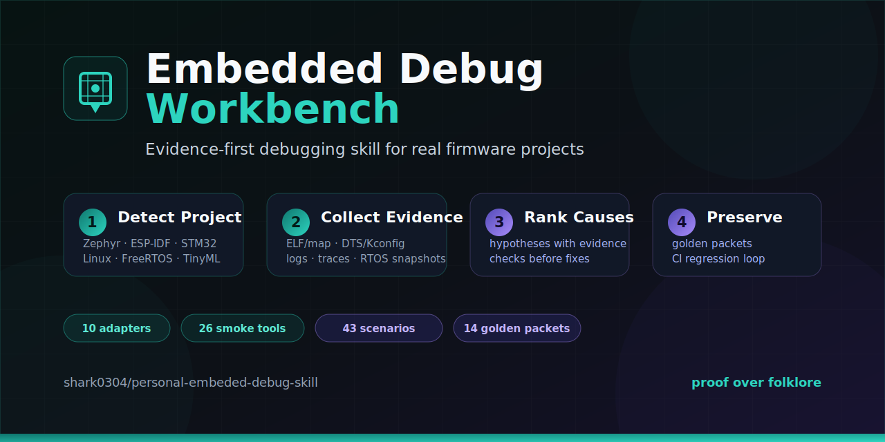
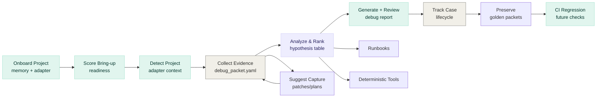

<p align="center">
  
</p>

<h1 align="center">Embedded Debug Workbench</h1>

<p align="center">
  <strong>Turn messy firmware failures into project memory, evidence packets, ranked hypotheses, and verification-ready fixes.</strong>
</p>

<p align="center">
  <a href="https://github.com/shark0304/personal-embeded-debug-skill/actions/workflows/validate-skills.yml"></a>
  
  
  
  
  
</p>

<p align="center">
  <a href="#start-here">Start Here</a> ·
  <a href="#real-project-adapters">Project Adapters</a> ·
  <a href="#debug-recipes">Debug Recipes</a> ·
  <a href="docs/operating_loop.md">Operating Loop</a> ·
  <a href="docs/public_project_mining.md">Project Mining</a> ·
  <a href="#workflow">Workflow</a> ·
  <a href="#validation">Validation</a>
</p>

---

## Why It Exists

Embedded failures are expensive because the evidence is scattered: logs, linker maps, fault registers, devicetree output, RTOS snapshots, scope traces, and half-remembered board history. This workbench makes the failure engineering loop explicit:

<p align="center">
  <strong>onboard project → check readiness → collect decisive evidence → review reports → verify fixes → preserve notebooks/golden packets</strong>
</p>

It is not an embedded encyclopedia. It is a workbench for reducing guesswork.

## Start Here

| I have... | Run this | You get |
|---|---|---|
| A real repo to connect for the first time | `scripts/project/onboard_project.py` | Project memory, adapter packet, readiness report, `debug/README.md` |
| A real firmware or BSP repo | `scripts/project/run_project_triage.py` | Project type, evidence score, safe next commands, triage report |
| A board bring-up repo before risky changes | `scripts/project/score_bringup_readiness.py` | Readiness score, missing project facts, recovery/evidence checklist |
| A project that needs persistent board/toolchain facts | `scripts/project/init_project_memory.py` | `.embedded-debug.yml` project memory |
| A project and want manual adapter details | `scripts/project/detect_project_context.py` | Project type, artifact checklist, safe command suggestions |
| Logs, ELF/map, DTS/Kconfig, or RTOS snapshots | `scripts/collect/collect_debug_packet.py` | Reproducible `debug_packet.yaml` |
| A packet and want to know if evidence is enough | `scripts/collect/validate_debug_packet.py` | Completeness score and missing evidence checklist |
| A packet and need the next capture patch | `scripts/project/suggest_evidence_capture.py` | Capture templates for HardFault, RTOS, Zephyr, Linux, I2C, and lab evidence |
| A proposed root cause or fix | `scripts/verify/generate_fix_verification_plan.py` | Before/after proof plan and acceptance criteria |
| A debug report before handoff | `scripts/review/review_debug_report.py` | Premature-conclusion checks and handoff readiness score |
| A failure case that needs lifecycle tracking | `scripts/project/update_failure_case.py` | Status transitions and optional golden-packet candidate export |
| Public repos to study for adapter coverage | `scripts/research/mine_github_projects.py` | Rate-limited candidate corpus for embedded project mining |
| A suspected root cause | `scripts/reports/generate_debug_report.py` | Scored report with verification steps |
| A new embedded idea | `embedded-project-builder/` | Project plan, scaffold, validation checklist |

### 60-second onboarding

```bash
python scripts/project/onboard_project.py \
  --project-root . \
  --symptom "I2C sensor probe failed" \
  --overwrite

python scripts/project/run_project_triage.py \
  --project-root . \
  --symptom "I2C sensor probe failed"
```

Add project memory when the same board will be debugged repeatedly:

```bash
python scripts/project/init_project_memory.py \
  --project-root . \
  --overwrite

python scripts/project/score_bringup_readiness.py \
  --project-root . \
  --format markdown
```

Manual path:

```bash
python scripts/project/detect_project_context.py \
  --project-root . \
  --format markdown

python scripts/project/create_project_adapter.py \
  --project-root . \
  --out-dir debug/embedded_debug_adapter \
  --overwrite

python scripts/collect/collect_debug_packet.py \
  --project-root . \
  --platform auto \
  --out debug_packet.yaml
```

## What You Get

| Capability | What it does |
|---|---|
| **Project onboarding** | Creates `.embedded-debug.yml`, adapter packet, readiness report, and local debug workspace guidance in one pass. |
| **Project adapters** | Detects Zephyr, ESP-IDF, PlatformIO, STM32Cube, Arduino, bare-metal CMake/Make, Embedded Linux, FreeRTOS, and TinyML projects. |
| **Bring-up readiness** | Scores whether board identity, toolchain, recovery path, safe commands, and first evidence are ready before risky debugging starts. |
| **Project memory** | Stores board, toolchain, safe commands, recovery path, and expected artifacts in `.embedded-debug.yml`. |
| **Evidence packets** | Normalizes logs, ELF/map, DTS/Kconfig, serial output, fault registers, board context, and missing evidence. |
| **Evidence scoring** | Scores whether a packet is ready for analysis or still too thin for root-cause claims. |
| **Evidence capture suggestions** | Recommends removable instrumentation snippets and lab capture plans from the current packet and symptom. |
| **Failure notebooks** | Preserves a local case folder with packet, lifecycle status, evidence, hypotheses, fix verification, outcome, and issue record. |
| **Report review** | Checks debug reports for missing evidence discipline, unsupported certainty, weak verification, and handoff readiness. |
| **Public project mining** | Discovers public embedded repos, scores relevance, snapshots manifest files, and builds a corpus index without default full clones. |
| **Pattern matching** | Ranks bundled failure patterns against packet evidence before jumping to a root cause. |
| **Deterministic analyzers** | Runs focused checks for HardFaults, ESP-IDF panics, Linux logs, DMA/cache alignment, RTOS waits, UART/I2C timing, memory budgets, and TinyML vectors. |
| **Regression loop** | Converts resolved cases into golden packets and validates future skill behavior with CI. |

## Real Project Adapters

The adapter layer is conservative by design. It suggests commands and evidence, but hardware-changing actions are labeled before anyone runs them.

| Adapter | Strong signals | First evidence to capture |
|---|---|---|
| **Zephyr / nRF Connect SDK** | `west.yml`, `prj.conf`, generated `zephyr.dts` | build log, serial log, DTS, Kconfig |
| **ESP-IDF** | `sdkconfig`, `idf_component.yml`, `idf_component_register` | monitor log, partition table, ELF/map |
| **PlatformIO** | `platformio.ini` | selected environment, `.pio` ELF/map, serial log |
| **STM32Cube** | `.ioc`, `Core/Src`, `Drivers/CMSIS` | `.ioc`, linker script, fault registers, ELF/map |
| **Arduino** | `.ino` sketches | FQBN, serial log, core/package version |
| **Bare-metal CMake/Make** | `CMakeLists.txt`, `Makefile`, linker/startup files | build log, linker script, ELF/map |
| **Embedded Linux** | `Kbuild`, `Kconfig`, DTS/DTSI, module markers | boot log, `dmesg`, kernel config, DTS/DTB |
| **FreeRTOS** | `FreeRTOSConfig.h`, kernel sources | task snapshot, heap/stack state, ISR priorities |
| **TinyML** | `.tflite`, TFLite Micro sources | model, arena, op resolver, golden vectors, latency |

Risk labels: `safe-local-build`, `safe-local-test`, `host-io`, `debugger-attached`, `hardware-write`, `kernel-runtime-change`.

Read the full workflow in [docs/project_adapters.md](docs/project_adapters.md).

## Debug Recipes

| Symptom | Useful tools |
|---|---|
| Cortex-M HardFault or BusFault | `fault_analyzer.py`, `symbolicate_addresses.py`, `map_memory_summary.py` |
| Zephyr I2C sensor probe failed | `analyze_i2c_init_failure.py`, `dts_probe_check.py`, `kconfig_check.py` |
| ESP-IDF panic, WDT, or Guru Meditation | `esp_panic_parse.py`, `map_memory_summary.py` |
| FreeRTOS deadlock or priority inversion | `rtos_snapshot_check.py`, `freertos_wait_graph.py`, `nvic_priority_check.py` |
| DMA works in polling but fails in interrupt path | `dma_buffer_check.py`, `map_memory_summary.py` |
| Embedded Linux driver probe/deferred probe | `linux_log_triage.py`, `dts_probe_check.py`, `boot_log_timeline.py` |
| TinyML memory, latency, or vector mismatch | `memory_budget.py`, `latency_budget.py`, `vector_compare.py` |
| Low-power current budget drift | `average_current.py`, low-power runbook, measurement plan templates |

See [docs/debug_recipes.md](docs/debug_recipes.md) for evidence, commands, and verification criteria for each recipe.

## Public Project Mining

```bash
python scripts/research/mine_github_projects.py --dry-run

python scripts/research/mine_github_projects.py \
  --query "zephyr prj.conf embedded firmware" \
  --limit 100 \
  --delay 2 \
  --out research/project_corpus/candidates.jsonl

python scripts/research/score_embedded_relevance.py \
  --input research/project_corpus/candidates.jsonl \
  --out research/project_corpus/candidates_scored.jsonl \
  --min-score 20
```

See [docs/public_project_mining.md](docs/public_project_mining.md) for the full rate-limited workflow. The default path uses official APIs, environment `GITHUB_TOKEN`, manifest snapshots, and ignored local corpus outputs.

## Failure Workflow

```bash
python scripts/project/onboard_project.py --project-root . --symptom "failure statement" --overwrite
python scripts/project/init_project_memory.py --project-root . --overwrite
python scripts/project/score_bringup_readiness.py --project-root . --format markdown
python scripts/project/run_project_triage.py --project-root . --symptom "failure statement"
python scripts/project/suggest_evidence_capture.py --packet debug/debug_packet.yaml --symptom "failure statement" --format markdown
python scripts/analyze/match_failure_patterns.py --packet debug/debug_packet.yaml --format markdown
python scripts/review/review_debug_report.py --report debug/project_triage_report.md --format markdown
python scripts/verify/generate_fix_verification_plan.py \
  --packet debug/debug_packet.yaml \
  --hypothesis "candidate root cause"
python scripts/project/create_failure_notebook.py \
  --project-root . \
  --symptom "failure statement"
python scripts/project/update_failure_case.py \
  --case-dir debug/failure-notebook/<case-id> \
  --status verified \
  --verification "before/after evidence matches"
```

## Workflow



## Supported Domains

| Domain | Focus |
|---|---|
| **Cortex-M** | HardFault, MemManage, BusFault, UsageFault, stack unwinding |
| **Zephyr** | Sensor/I2C/IMU bring-up, DTS/Kconfig, thread/ISR behavior |
| **ESP-IDF** | Panic/WDT logs, partition table, NVS, Wi-Fi/BLE, OTA |
| **Embedded Linux** | Boot logs, device tree, driver probe, tracing, sysfs/debugfs |
| **FreeRTOS** | Stack, heap, deadlock, priority inversion, ISR-to-task paths |
| **TinyML** | TFLite Micro arena, operator coverage, latency, quantization |
| **DMA/Cache** | Coherency, alignment, invalidation, double-buffer races |
| **MCUboot/OTA** | Slot state, signing, swap, rollback, secure boot evidence |

## Two-skill Model

| Skill | Role | When to use |
|---|---|---|
| **`embedded-project-builder`** | Upstream planning | 0-to-1 project scaffold, datasheet reading, driver bring-up, validation planning |
| **`embedded-debug`** | Downstream debug | After a concrete failure appears: collect packets, analyze, report, preserve |

```text
project plan -> scaffold -> build -> fail -> collect packet -> analyze -> report -> preserve
```

## Repository Map

```text
SKILL.md                       Codex entry and routing rules
embedded-project-builder/      Upstream project planning skill
docs/project_adapters.md       Real project adapter workflow
docs/debug_recipes.md          Evidence-first debug recipes
docs/operating_loop.md         Project onboarding and failure case lifecycle
docs/public_project_mining.md  Rate-limited public embedded project mining
examples/projects/             Synthetic mini project fixtures
references/                    Runbooks, platform packs, failure patterns
scripts/project/               Real project detection and adapter generation
scripts/review/                Debug report review and evidence-discipline checks
scripts/collect/               Debug packet collection
scripts/analyze/               Focused analyzers
scripts/verify/                Report scoring and fix verification planning
scripts/reports/               Debug report generation
scripts/research/              Public case and project corpus mining
profiles/                      Board, project, packet schemas
assets/templates/              Capture plans and instrumentation snippets
tests/golden_packets/          Regression-ready debug packets
```

## Validation

```bash
python scripts/verify/run_skill_regression.py
python scripts/smoke_test_tools.py
python scripts/validate_evaluation_scenarios.py
python scripts/project/run_project_triage.py \
  --project-root examples/projects/zephyr_i2c_probe_fail \
  --symptom "I2C sensor probe failed" \
  --packet-out /tmp/zephyr_debug_packet.yaml \
  --report-out /tmp/zephyr_triage_report.md
python -m pytest tests/
```

Current baseline:

| Check | Baseline |
|---|---|
| Golden packets | 14 |
| Evaluation scenarios | 43 |
| Smoke-tested tools | 45 |
| Project adapter / triage / failure workflow tests | 21 |

## Boundary

This skill does not replace hardware measurement. It is designed to make missing evidence explicit before conclusions are promoted. It will not treat flashing, debugger attach, fuse/option-byte changes, voltage changes, or Linux runtime module changes as default-safe actions.

<p align="center">
  <sub>Built for embedded engineers who prefer proof over folklore · <a href="https://github.com/shark0304/personal-embeded-debug-skill">shark0304/personal-embeded-debug-skill</a></sub>
</p>
