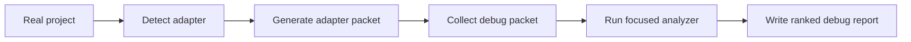

# Real Project Adapters

Project adapters let Embedded Debug Workbench enter a real firmware or BSP repository without guessing the workflow.

They do three conservative things:

1. Detect likely project families from local files.
2. Generate a local debug adapter packet with evidence globs, suggested commands, runbooks, and deterministic scripts.
3. Mark risky commands such as flash, debugger attach, and kernel runtime changes before anyone runs them.

They do not run hardware-changing commands, fetch metadata from the network, or claim a root cause.

## Quick Start

From the root of a firmware or BSP project:

```bash
python /path/to/personal-embeded-debug-skill/scripts/project/detect_project_context.py \
  --project-root . \
  --format markdown
```

Create a project-local adapter packet:

```bash
python /path/to/personal-embeded-debug-skill/scripts/project/create_project_adapter.py \
  --project-root . \
  --out-dir debug/embedded_debug_adapter \
  --overwrite
```

Then collect the normal debug packet:

```bash
python /path/to/personal-embeded-debug-skill/scripts/collect/collect_debug_packet.py \
  --project-root . \
  --platform auto \
  --out debug_packet.yaml
```

## Supported Project Families

| Adapter | Signals | Typical next evidence |
|---|---|---|
| Zephyr / nRF Connect SDK | `west.yml`, `prj.conf`, generated `zephyr.dts`, `.config` | build log, serial log, generated DTS/Kconfig, I2C traces |
| ESP-IDF | `sdkconfig`, `idf_component.yml`, `idf_component_register` | monitor log, SDK config, partition table, ELF/map |
| PlatformIO | `platformio.ini` | selected environment, `.pio` ELF/map, serial log |
| STM32Cube | `.ioc`, `Core/Src`, `Drivers/CMSIS` | CubeMX `.ioc`, linker script, ELF/map, fault registers |
| Arduino | `.ino` | FQBN, serial log, core/package versions |
| Bare-metal CMake | `CMakeLists.txt`, linker/startup files | toolchain file, build log, ELF/map |
| Bare-metal Make | `Makefile`, linker/startup files | build log, target list, ELF/map |
| Embedded Linux | `Kbuild`, `Kconfig`, DTS/DTSI, module markers | boot log, dmesg, kernel config, DTS/DTB |
| FreeRTOS | `FreeRTOSConfig.h`, kernel sources | task snapshot, heap/stack state, ISR priorities |
| TinyML | `.tflite`, TFLite Micro source/model files | model, arena size, op resolver, latency and golden vectors |

## Risk Labels

| Label | Meaning |
|---|---|
| `safe-local-build` | Local build/configure action; does not touch target hardware. |
| `safe-local-test` | Local tests or build-only validation. |
| `host-io` | Reads logs or opens a host/serial connection. |
| `debugger-attached` | May halt, reset, or inspect target hardware. |
| `hardware-write` | Writes flash or changes target nonvolatile state. |
| `kernel-runtime-change` | Changes a running Linux target; needs rollback. |

## Practical Flow



Keep the adapter packet in the project `debug/` directory when it helps team handoff. Do not commit logs or captures that contain secrets, customer data, proprietary firmware blobs, or private board identifiers unless your project policy allows it.
